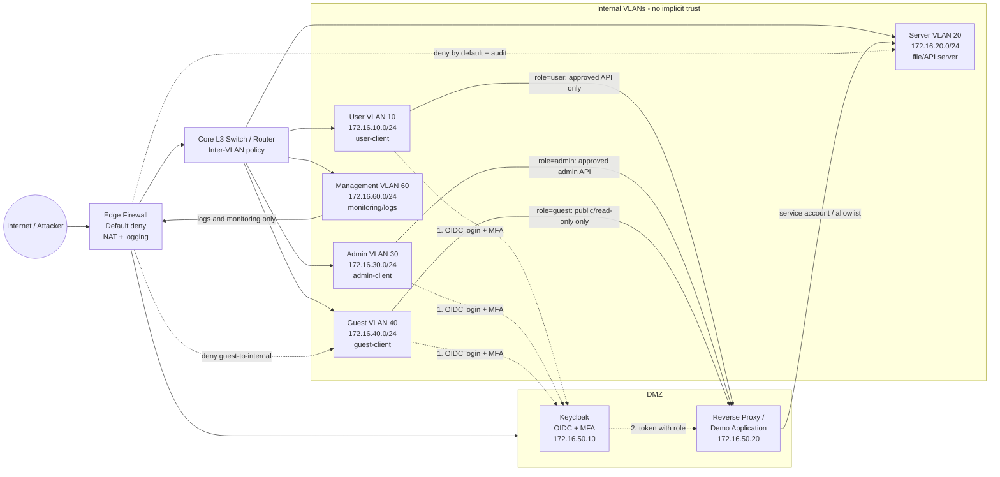

# Sơ đồ mạng Zero Trust LAN

Sơ đồ dưới đây dùng cho lab Docker hoặc có thể ánh xạ sang EVE-NG, PNETLab, VMware, VirtualBox hay Hyper-V.

## Bảng phân vùng và quyền

| VLAN | Mạng | Thành phần | Quyền chính |
|---|---|---|---|
| 10 | `172.16.10.0/24` | Máy người dùng | Đăng nhập MFA; chỉ gọi API được cấp |
| 20 | `172.16.20.0/24` | File/API server | Chỉ nhận kết nối từ gateway hoặc luồng được allowlist |
| 30 | `172.16.30.0/24` | Máy quản trị | MFA bắt buộc; truy cập quản trị theo role và nguồn |
| 40 | `172.16.40.0/24` | Máy khách/khách | Chỉ Internet và dịch vụ công khai; cấm truy cập nội bộ |
| 50 | `172.16.50.0/24` | Keycloak, reverse proxy | DMZ; không truy cập tùy ý vào server nội bộ |
| 60 | `172.16.60.0/24` | Log/monitoring | Chỉ nhận log và thực hiện giám sát quản trị |

## Luồng demo bắt buộc

1. **Lab setup:** dựng firewall, các VLAN/network, Keycloak, gateway và server; tạo `admin`, `user`, `guest`.
2. **Exploitation/test:** thử truy cập server trực tiếp, thử bỏ qua MFA, thử dùng token sai role, và thử `guest` truy cập vùng nội bộ.
3. **Defense & mitigation:** bật default-deny, bắt buộc MFA, kiểm tra role trong gateway, giới hạn source/destination và ghi log.
4. **Re-test:** chạy lại đúng các lệnh kiểm thử; truy cập hợp lệ phải thành công, truy cập sai role hoặc sai VLAN phải bị từ chối và có log.

## Nguyên tắc an toàn

Chỉ thực hiện kiểm thử trên lab cô lập, dùng tài khoản và dữ liệu giả. Không quét hoặc khai thác mạng doanh nghiệp thật khi chưa có ủy quyền bằng văn bản.